# Index
- Para contas originais do Minecraft: [Client](https://github.com/dsalexan/ftb-server#client)
- Para acesso pirata: [Pirate](https://github.com/dsalexan/ftb-server#pirate)

# Client

## Specs

### Minimum
- **DO NOT USE OPTIFINE**
- **RAM**: *4.5GB*

### Recommended
- **RAM**: *8GB*

## Server

### IP
35.199.100.22:25565

## Original

### 1) Installation
- 1) Install Curse Forge
- 2) At Curse Forge, go to Home and choose Minecraft as game
- 3) Install FTB Revelation modpack, version **3.4.0**
  - 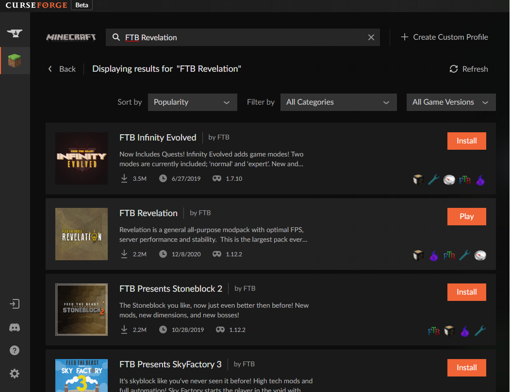
- 4) Open modpack page
  - 
- 5) Open modpack folder
  - 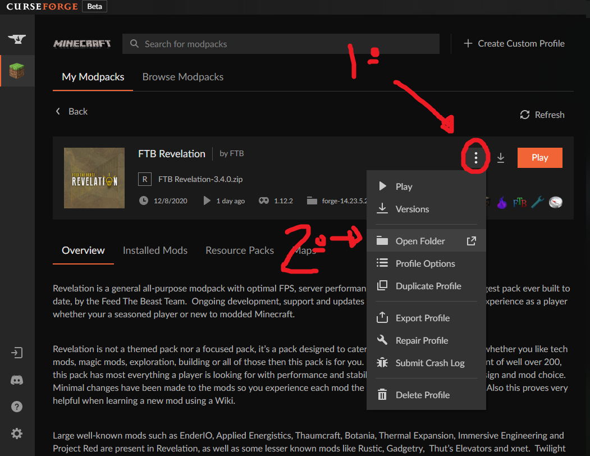
- 6) Open mods folder
  - 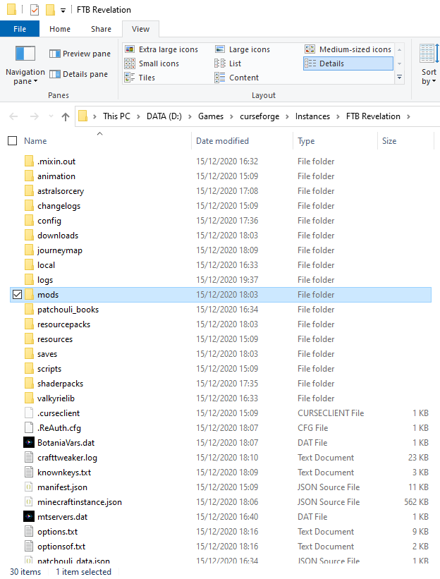
- 7) Drag OPTIFINE and VOICE CHAT to folder (**check github repo**)
  - 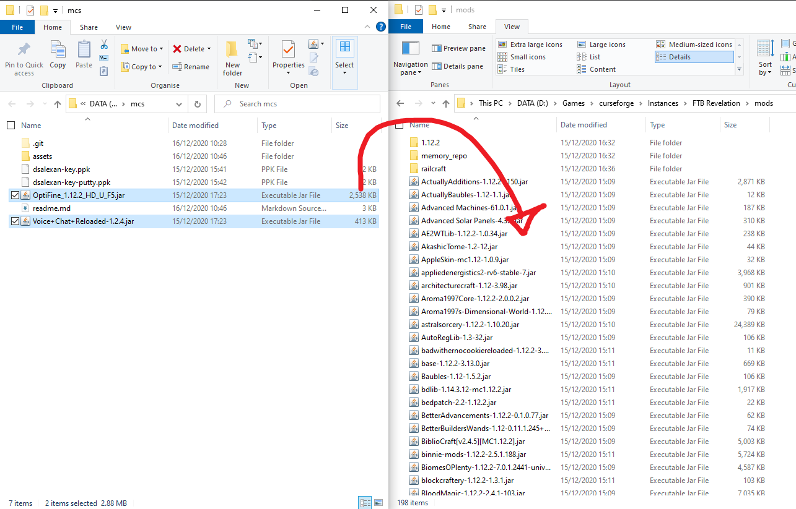

### Configuration

#### Recommended Specs
- At Curse Forge, click Play
  - 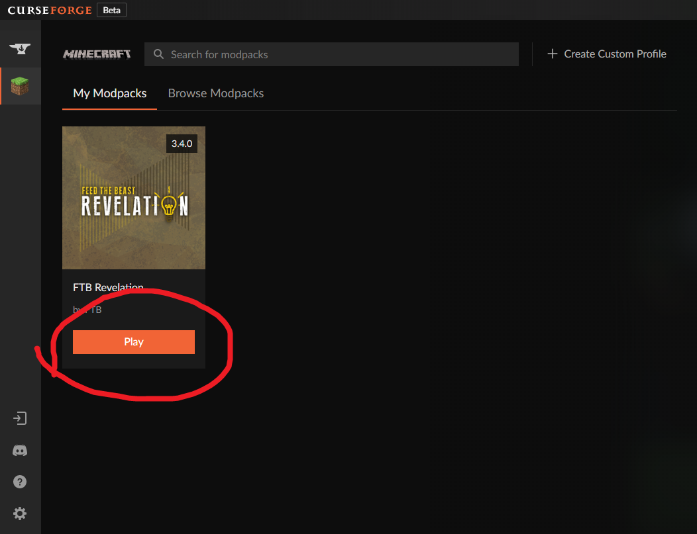
- Go to Installations > FTB Revelations > Edit
  - 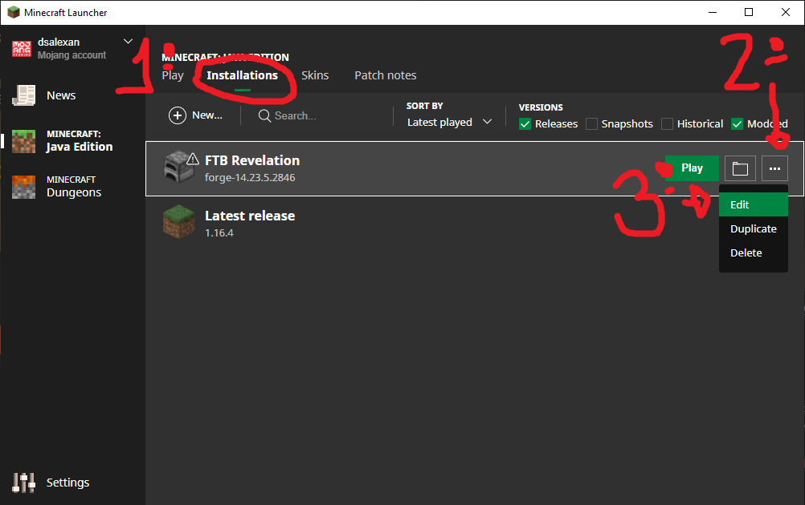
- More options
  - 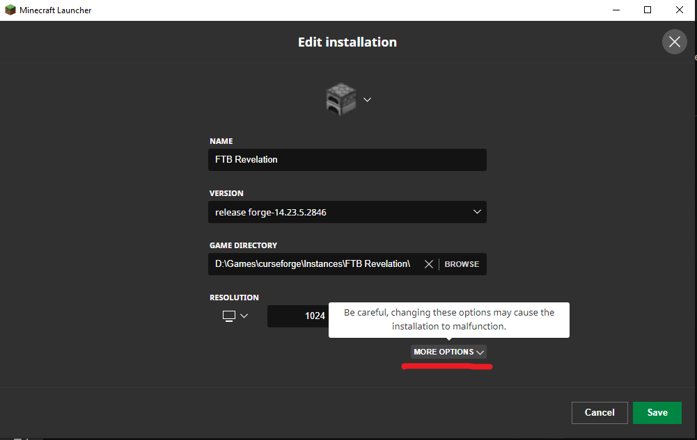
- Replace *4096M* by *5G*
  - Esse "-Xmx4096m" é a memoria RAM dedicada ao minecraft. Pra rodar com esse modpack o minimo mesmo seria uns "4500M", então recomendo colocar um valor ao redor disso. Deixar 4096m (em outras palavras, 4GB de ram dedicada) pode dar ruim. Sei la, honestamente. Não sou especialista.
  - 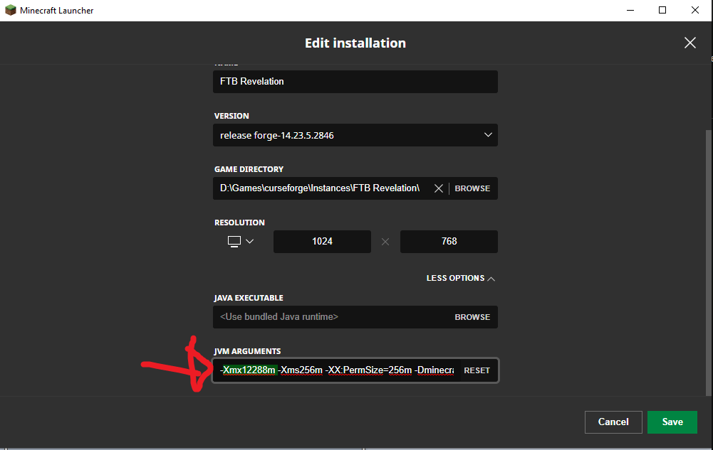

### Run
- At Curse Forge, click Play
  - 
- Make sure FTB Revelations is selected, then click Play
  - 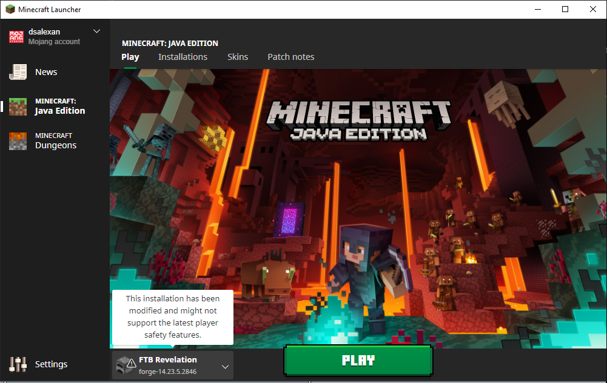
- It can take from **6 to 10 min** to start
- Click Multiplayer > Add Server
- Input server name (A Xmas Special) and address (35.199.100.22:25565)
  - 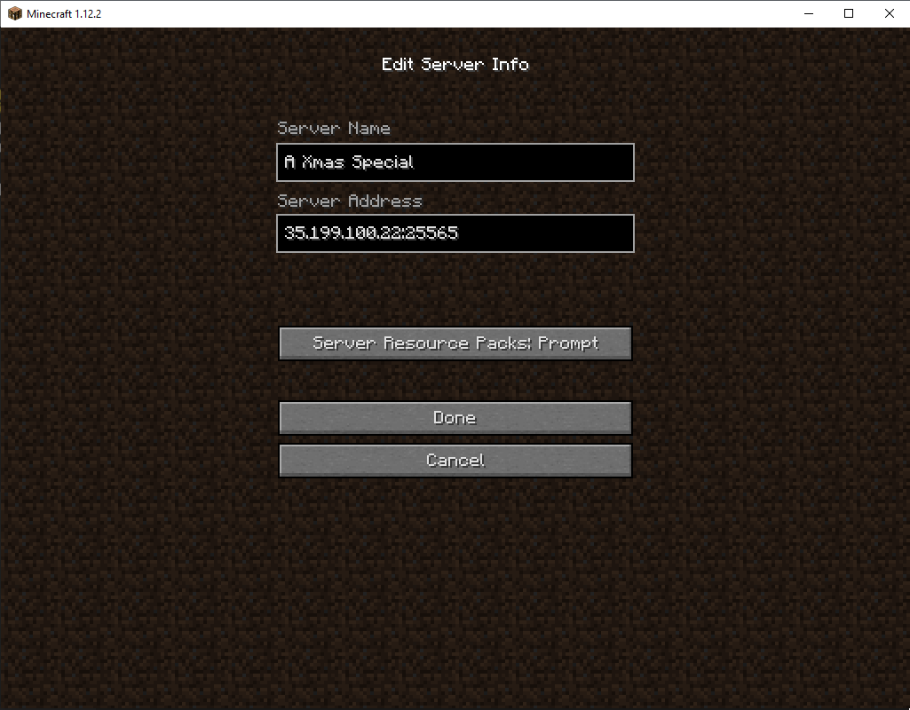

#### Minecraft Launcher Run times
- *15/12, started at 20:34 and ended at 20:40* — **~6min** (at 4GB)
- *15/12, started at 21:06 and ended at 21:10* — **~4min** (at 10GB)

## Pirate

### Installation
- Install TLauncher (https://tlauncher.org/en/)
- Select version **ForgeOptifine 1.12.2** or **Forge 1.12.2**, then click Install
  - 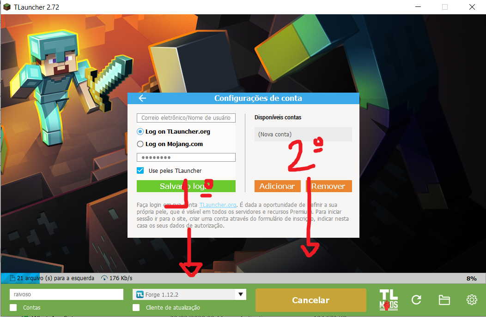
- Click the **gear logo* at bottom-right, and choose *Settings*
  - 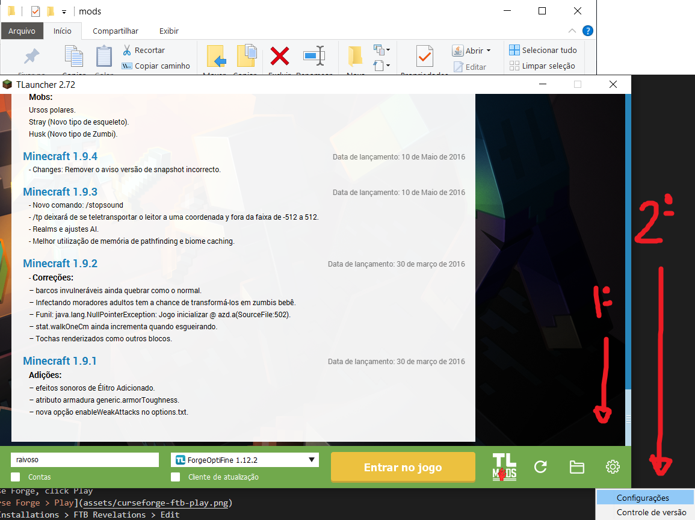
- In *Distinguir memória*, input *at least* **4500** (then click **Reter**)
  - Esse "4096" é a memoria RAM dedicada ao minecraft (em megabytes). Pra rodar com esse modpack o minimo mesmo seria uns "4500", então recomendo colocar um valor ao redor disso. Deixar 4096 (em outras palavras, 4GB de ram dedicada) pode dar ruim. Sei la, honestamente. Não sou especialista.
  - 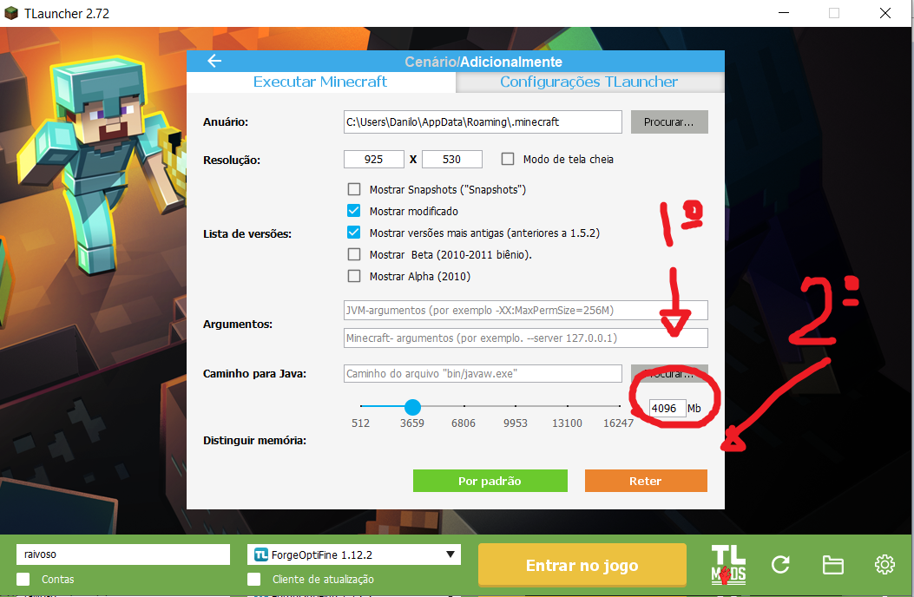
- Click in TL Mods
  - 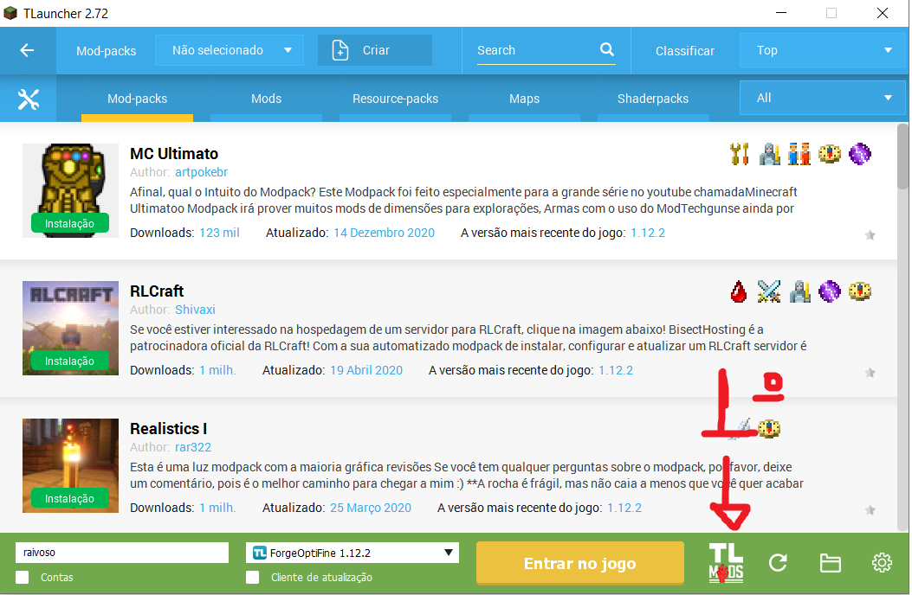
- Search for ***FTB Revelation***, then click *install* at first result
  - 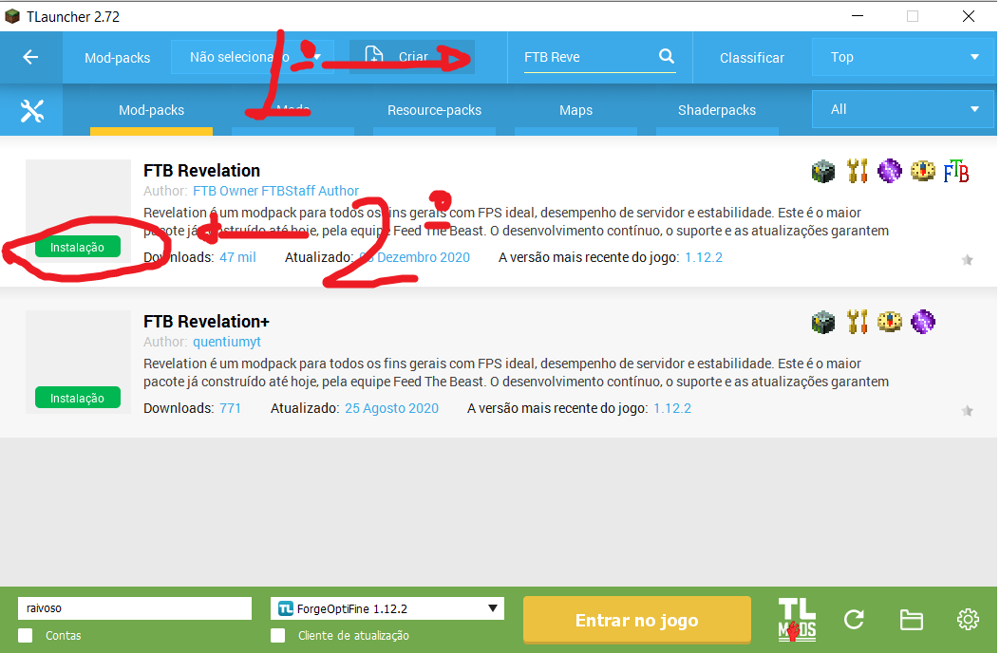
- Change to ***mods*** tab, then search for ***Voice***, then click *install* at first result
  - 

### Run
- At TLauncher, click Play
- Make sure the profile ***with FTB Revelation 3.4.0*** is selected
- It can take from **6 up to 10 min** to start
- If a message about *MineTogether*/*Offline client* appears, click **Continue**
- Click Multiplayer > Add Server
- Input server name and address (35.199.100.22:25565)
  - 

# Server
***ESSA SEÇÃO DO TUTORIAL É SÓ PRO CONDENADO QUE TIVER QUE SUBIR UM SERVIDOR NOVO***

***SE TU SÓ QUER JOGAR NUM SERVIDOR Q JA EXISTE, O TUTORIAL ACABOU***

***SE ESSE NÃO É O CASO PRA TU***

***BOA SORTE***

## Setup

### Criar VM para minecraft
https://cloud.google.com/solutions/gaming/minecraft-server#schedule_backups

### Habilitar ftp na VM
https://cloud.google.com/compute/docs/instances/transfer-files#winscp

### Liberar acesso em pasta no Linux
https://askubuntu.com/questions/402980/give-user-write-access-to-folder

### Instalar FTB Revelation (ou FTB modpack qualquer)
https://forum.feed-the-beast.com/threads/guide-basic-notes-on-installing-ftb-infinity-evolved-server-on-linux-ubuntu-18-04-lts.302815/

- Jogar arquivo de instalação do FTB para linux dentro do server

#### server.properties
- online-mode=false *Q Q CUSTA COMPRAR A PORRA DO JOGO*

#### ops.json
- Inserir nicks de administradores

### External mods
At server folder, open mods and add:
- Voice chat

## Serve

### Start in screen

**sudo screen -S server sh ./start.sh**

- *15/12, started at 20:35 and ended at 20:40* — **~5min**

### Dettach from screen
CTRL + A + D

### Rettach to screen
sudo screen -r server

