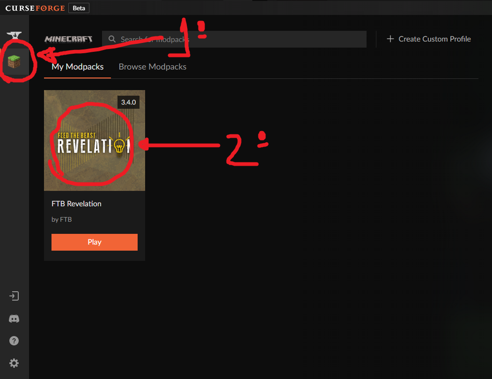

# Index
- Para contas originais do Minecraft: [Client](https://github.com/dsalexan/ftb-server#client)
- Para acesso pirata: [Pirate](https://github.com/dsalexan/ftb-server#pirate)

# Client

## Specs

### Minimum
- **DO NOT USE OPTIFINE**
- **RAM**: *4GB*

### Recommended
- **RAM**: *8GB*

## Server

### IP
35.199.100.22:25565

## Original

### Installation
- Install Curse Forge
- At Curse Forge, go to Home and choose Minecraft as game
- Install FTB Revelation modpack, version **3.4.0**
  - 
- Open modpack page
  - 
- Open modpack folder
  - 
- Open mods folder
  - 
- Drag OPTIFINE and VOICE CHAT to folder (**check github repo**)
  - 

### Configuration

#### Recommended Specs
- At Curse Forge, click Play
  - 
- Go to Installations > FTB Revelations > Edit
  - 
- More options
  - 
- Replace *4096M* by *8G* and *256M* by *4G*
  - 

### Run
- At Curse Forge, click Play
  - 
- Make sure FTB Revelations is selected, then click Play
  - 
- It can take from **6 to 10 min** to start
- Click Multiplayer > Add Server
- Input server name and address (35.199.100.22:25565)
  - 

#### Minecraft Launcher Run times
- *15/12, started at 20:34 and ended at 20:40* — **~6min** (at 4GB)
- *15/12, started at 21:06 and ended at 21:10* — **~4min** (at 10GB)

## Pirate

### Installation
- Install TLauncher (https://tlauncher.org/en/)
- Select version **ForgeOptifine 1.12.2** or **Forge 1.12.2**, then click Install
  - 
- Click the **gear logo* at bottom-right, and choose *Settings*
  - 
- In *Distinguir memória*, input *at least* **6124** (then click **Reter**)
  - 
- Close Minecraft (**not TLauncher, keep it open**), open Curse Forge
- In Choose a game, pick **Minecraft**
  - If the game is not automatically detected, input %appdata/.minecraft as directory
- Install FTB Revelation modpack, version **3.4.0**
  - 
- Open modpack page
  - 
- Open modpack folder
  - 
- Open mods folder
  - 
- Drag VOICE CHAT to folder (**check github repo**), and don't close the window
  - 
- In TLauncher, open minecraft folder
  - 
- Copy all ***inexistent folders*** from *\<FTB instance folder\>* to *\<TLauncher minecraft folder\>*
  - 
- Copy the ***config*** folder from *\<FTB instance folder\>* to *\<TLauncher minecraft folder\>*, replacing all files
- Copy ***mod's folder CONTENT*** from *\<FTB instance folder\>/mods* to *\<TLauncher minecraft folder\>/mods*, replacing all files
  - 

### Run
- At TLauncher, click Play
- It can take from **6 to 10 min** to start
- If a message about *MineTogether*/*Offline client* appears, click **Continue**
- Click Multiplayer > Add Server
- Input server name and address (35.199.100.22:25565)
  - 

# Server

## Setup

### Criar VM para minecraft
https://cloud.google.com/solutions/gaming/minecraft-server#schedule_backups

### Habilitar ftp na VM
https://cloud.google.com/compute/docs/instances/transfer-files#winscp

### Liberar acesso em pasta no Linux
https://askubuntu.com/questions/402980/give-user-write-access-to-folder

### Instalar FTB Revelation (ou FTB modpack qualquer)
https://forum.feed-the-beast.com/threads/guide-basic-notes-on-installing-ftb-infinity-evolved-server-on-linux-ubuntu-18-04-lts.302815/

- Jogar arquivo de instalação do FTB para linux dentro do server

#### server.properties
- online-mode=false *Q Q CUSTA COMPRAR A PORRA DO JOGO*

#### ops.json
- Inserir nicks de administradores

### External mods
At server folder, open mods and add:
- Voice chat

## Serve

### Start in screen

**sudo screen sh ./start.sh**

- *15/12, started at 20:35 and ended at 20:40* — **~5min**

### Dettach from screen
CTRL + A + D

### Rettach to screen
screen -r
